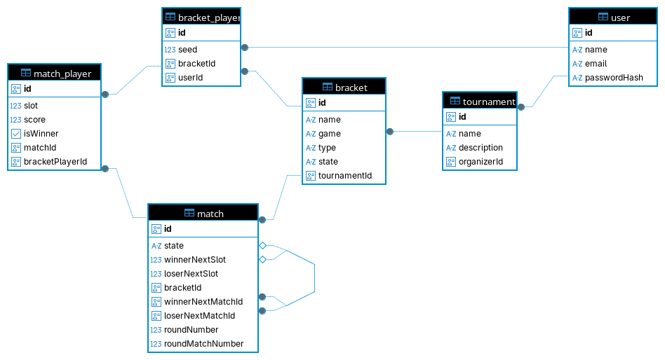
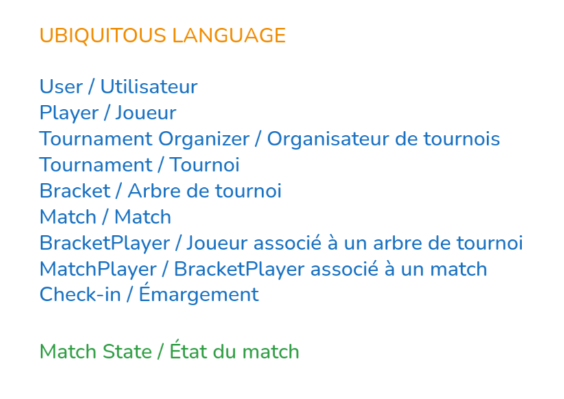
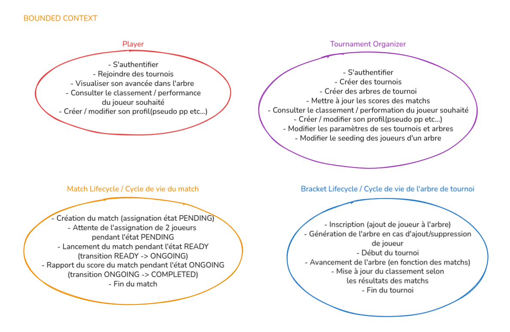
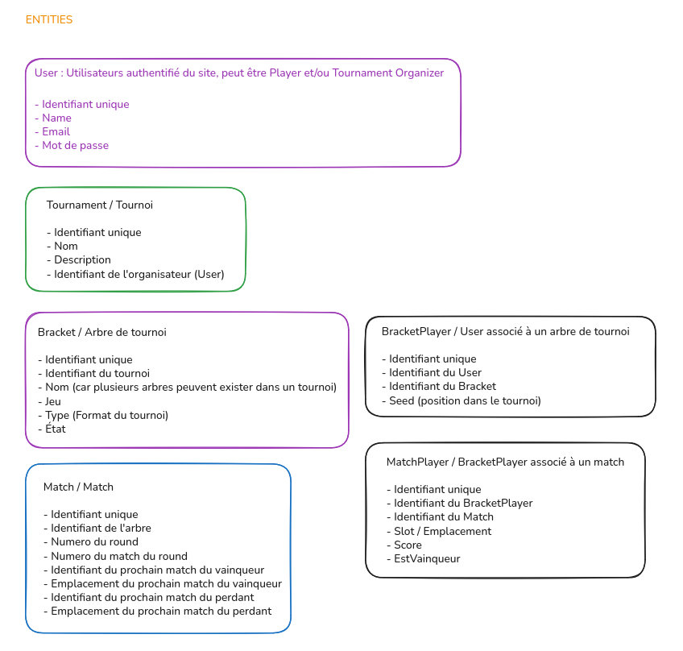
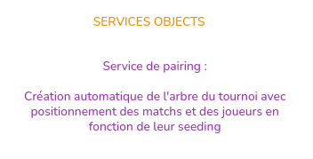

# gg.start - Documentation Technique

- [gg.start - Documentation Technique](#ggstart---documentation-technique)
  - [Technologies utilisées](#technologies-utilisées)
    - [Back-End](#back-end)
    - [Persistance des données](#persistance-des-données)
  - [Schéma de la base de données](#schéma-de-la-base-de-données)
  - [Domain Driven Design (DDD)](#domain-driven-design-ddd)
    - [Ubiquitous Language](#ubiquitous-language)
    - [Bounded Context](#bounded-context)
    - [Entities](#entities)
    - [Services Objects](#services-objects)

## Technologies utilisées

### Back-End

- Langage
  - [TypeScript](https://www.typescriptlang.org/)
- Api
  - [NestJS](https://nestjs.com/): Framework NodeJS pour réaliser des API (basé sur TypeScript)
- Dépendances externes
  - Documentation de l'API
    - @nestjs/swagger: OpenAPI/Swagger
  - Validation des données:
    - [class-validator](https://github.com/typestack/class-validator) et [class-transformer](https://github.com/typestack/class-transformer): (pour les Entity et Body)
  - ORM:
    - [typeorm](https://typeorm.io/): ORM pour interroger la base de données (s'intègre très bien avec NestJS)
    - [@nestjs/typeorm](https://github.com/nestjs/typeorm): Module Nest pour utiliser l'ORM
  - Configuration:
    - [@nestjs/config](https://github.com/nestjs/config): Module Nest pour importer des fichiers de configuration (.env)
  - Test:
    - [jest](https://jestjs.io/): Framework JavaScript de test
    - [@nestjs/testing](https://github.com/nestjs/testing): Module Nest pour les tests
  - Authentification
    - [@nestjs/jwt](https://github.com/nestjs/jwt): Module Nest pour manipuler des JWT

### Persistance des données

- Base de données
  - [PostgreSQL](https://www.postgresql.org/): Système de gestion de base de données relationnelle SQL Open Source

## Schéma de la base de données

## Domain Driven Design (DDD)

### Ubiquitous Language

### Bounded Context

### Entities

### Services Objects

